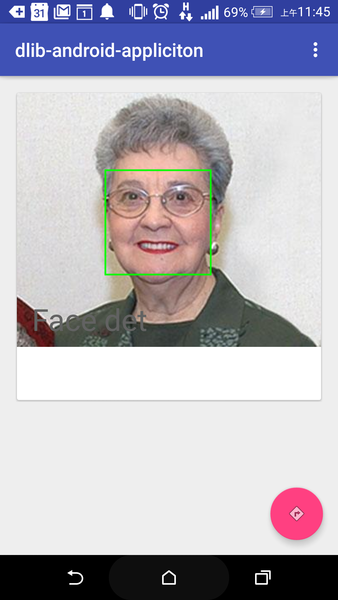
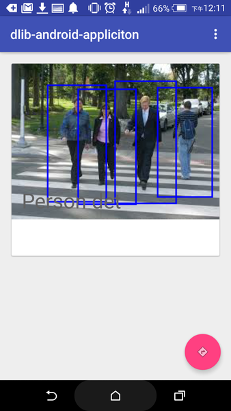
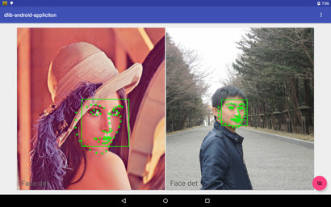

## dlib-android-app

[](https://travis-ci.org/tzutalin/dlib-android-app)
[  ](https://bintray.com/tzutalin/maven/dlib-android-app/_latestVersion)

See http://dlib.net for the main project documentation.

See [dlib-android](https://github.com/tzutalin/dlib-android) for JNI lib. Refer to dlib-android/jni/jnilib_ex

###Grap the source

`$ git clone https://github.com/tzutalin/dlib-android-app.git`

### Features

* Support HOG detector

* HOG Face detection

* Facial Landmark/Expression

### Demo




[](https://www.youtube.com/watch?v=TbX3t7QNhvs)

### Build

#### Android app
* Open Android studio to build

* Use command line to build (Optional)

On Windows platforms, type this command:

`$ gradlew.bat assembleDebug`

On Mac OS and Linux platforms, type these commands:

`$ chmod +x gradlew`

`$ ./gradlew assembleDebug`

#### Update shared lib (Optional)
You can build shared library from [dlib-android](https://github.com/tzutalin/dlib-android)

Copy the shared libray to ./dlib/src/main/jniLibs/

### Try directly

Install the apk

`$ adb install demo/app-debug.apk`

Otherwise, import the library to your build.gradle

```
repositories {
    maven {
        url 'https://dl.bintray.com/tzutalin/maven'
    }
}

dependencies {
    compile 'com.tzutalin.dlib-android-app:dlib:1.0.3'
}

```

### Sample code

Facial landmark detection
```java
PeopleDet peopleDet = new PeopleDet();
List<VisionDetRet> results = peopleDet.detBitmapFace(bitmap, Constants.getFaceShapeModelPath());
for (final VisionDetRet ret : results) {
    String label = ret.getLabel(); // If doing face detection, it will be 'Face'
    int rectLeft = ret.getLeft();
    int rectTop= ret.getTop();
    int rectRight = ret.getRight();
    int rectBottom = ret.getBottom();
    ArrayList<Point> landmarks = ret.getFaceLandmarks();
    for (Point point : landmarks) {
        int pointX = (int) (point.x * resizeRatio);
        int pointY = (int) (point.y * resizeRatio);
        // Get the point of the face landmarks
    }
}
```

### License
[License](LICENSE.md)
